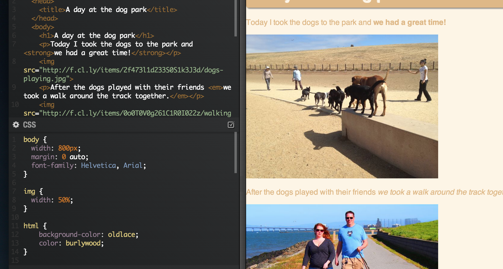

Lesson 3 - Advanced CSS
============================

## Overview
Last week we learned a bit about [Cascading Style Sheets](http://en.wikipedia.org/wiki/CSS) (CSS for short). Today we're going to dig back in and learn some advanced CSS tactics to really make our page look awesome!

## Recap
Last week we learned about a few things...

### Selectors - Classes, IDs, and parent-child relationships
- [We added a ```class``` attribute](https://github.com/CoderDojoSF/webdev-lesson-2-css/blob/master/README.md#classes) to one of our tags so we could apply styles to every element that was labeled with that class. 
- [We added an ```ID``` to an element](https://github.com/CoderDojoSF/webdev-lesson-2-css/blob/master/README.md#ids) to uniquely style an element.
- [We learned about parent-child relationships](https://github.com/CoderDojoSF/webdev-lesson-2-css/blob/master/README.md#parent-child-relationships) where we learned to select HTML elements based on which elements contained them. 

### Declarations
- [We learned about properties and values](https://github.com/CoderDojoSF/webdev-lesson-2-css/blob/master/README.md#properties) and how we can use them to give our elements some style.
- [We learned about states](https://github.com/CoderDojoSF/webdev-lesson-2-css/blob/master/README.md#css-rules-in-the-real-world) so you can make your CSS rules change when certain things happen.

## Box Model

In HTML, every element is a rectangular box. Every box a height and a width that defines how big it is and how much space it will take up on the page. 

If we want to make an image on our page 500px wide and 400px high, we could do the following:

```css
img {
	height: 400px;
	width: 500px;
}
```

However, that isn't the only thing that defines how our image fits on the page because every element is surrounded by three more things: **padding**, **border**, and **margin**. Understanding how your padding, borders, and margins work is essential to making sure that your elements look as expected. 

To help us understand this, we have this diagram:


The "border" is the edge of your box. Padding controls how close things inside the box can be to the border and Margin controls how close things outside the box can be to the border. 

Let's see how this works in practice...



If you look at the first image on the page, you'll notice how it  currently has no margin, padding, or border. As a result, it's pushed up against the left side of the page with no spacing 


## Position


## Float

## Transitions